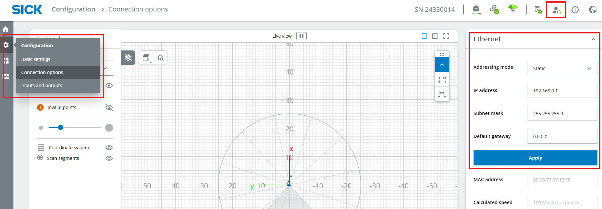
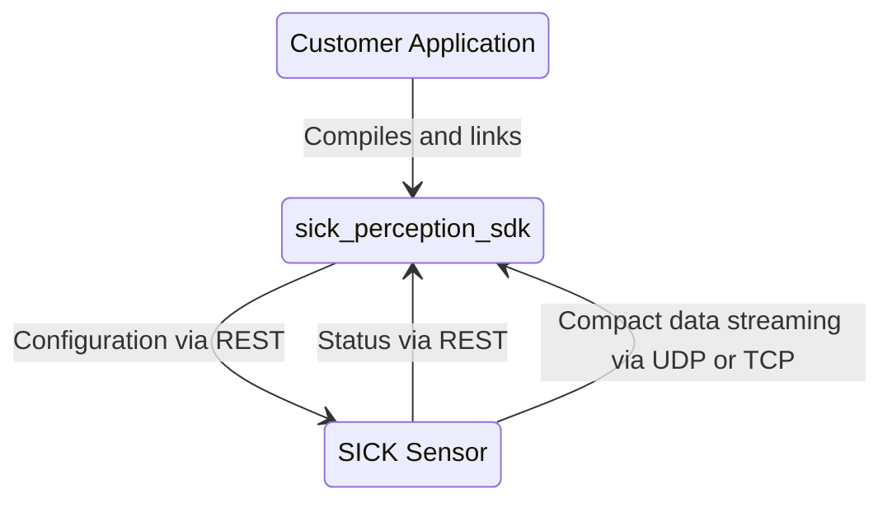
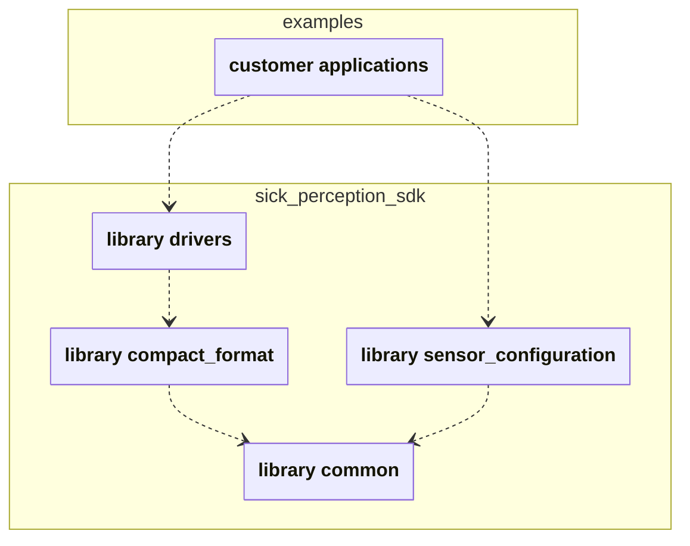
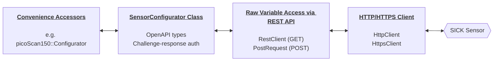
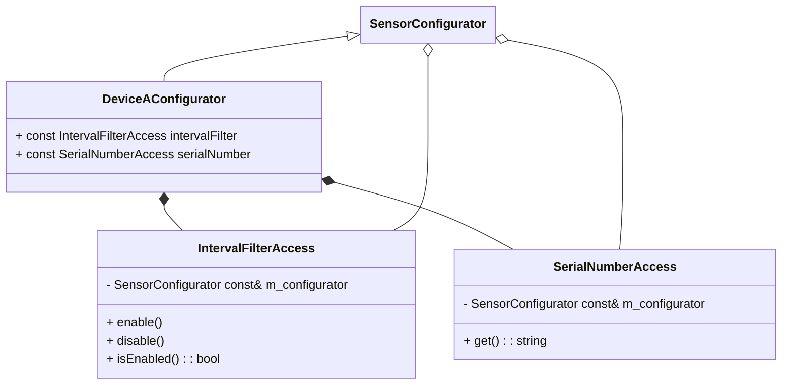
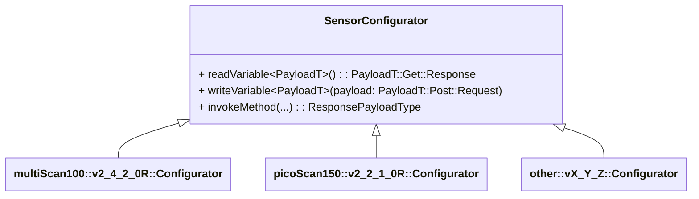
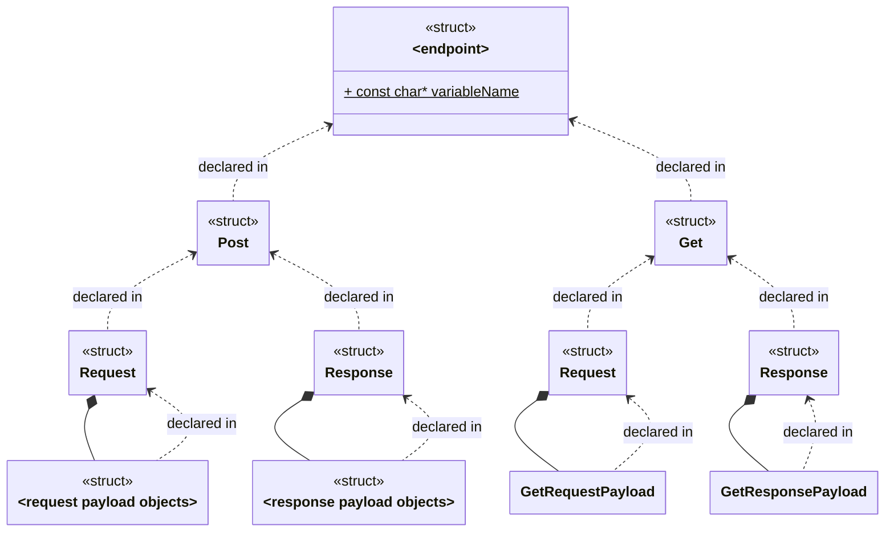
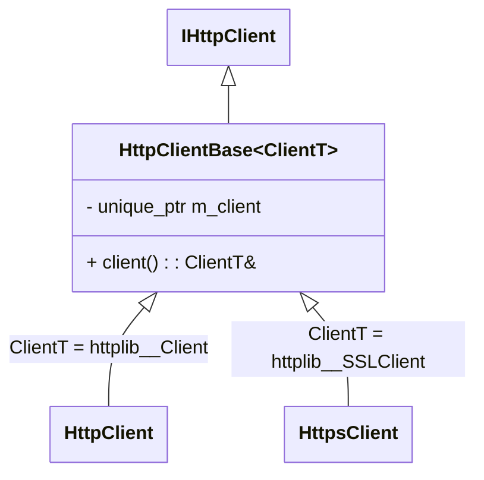
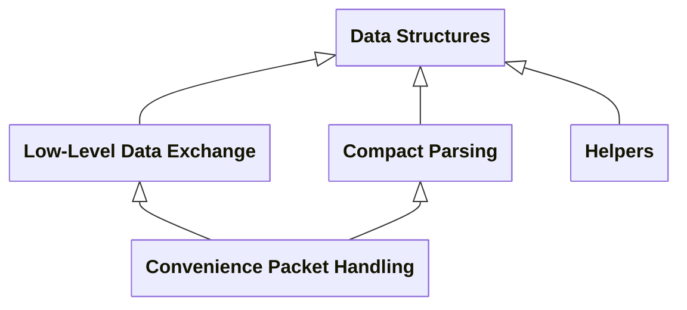

<div align="center">


<br/>


# sick_perception_sdk

A modern C++17 SDK for developing applications with various SICK LiDAR sensors and access to sensor configuration, scan data, and integration examples.


[](LICENSE)
[](https://github.com/SICKAG/sick_perception_sdk)
[](https://github.com/SICKAG/sick_perception_sdk)
[](https://github.com/SICKAG/sick_perception_sdk/issues)

[⚡️Getting started](#️-getting-started) • [🔄 Change Log](CHANGELOG.md)

</div>

<details>
  <summary><strong style="font-size:1.25em">Table of contents</strong></summary>

- [🏛️ Architectural overview](#️-architectural-overview)
- [✨ Features](#-features)
- [🛠️ Tested Compatibilities](#️-tested-compatibilities)
- [📦 Code Dependencies](#-code-dependencies)
- [⚡️ Getting Started](#️-getting-started)
  - [1) Setup the Ethernet Network and the SICK sensor](#1-setup-the-ethernet-network-and-the-sick-sensor)
  - [2a) Prepare Linux](#2a-prepare-linux)
  - [2b) Prepare Windows](#2b-prepare-windows)
  - [3) Clone the Repository](#3-clone-the-repository)
  - [4) Explore the Learning Examples](#4-explore-the-learning-examples)
  - [5a) Build the Learning Examples (CMake build including all Examples in-tree)](#5a-build-the-learning-examples-cmake-build-including-all-examples-in-tree)
  - [5b) Build the Learning Examples (Conan 2)](#5b-build-the-learning-examples-conan-2)
- [⚙️ Detailed Build Instructions](#️-detailed-build-instructions)
  - [Configuring the CMake Build](#configuring-the-cmake-build)
  - [Consuming the CMake Components](#consuming-the-cmake-components)
  - [Example CMake Workflow](#example-cmake-workflow)
  - [Conan 2](#conan-2)
  - [Static Builds on Windows](#static-builds-on-windows)
- [🧠 Technical Background](#-technical-background)
  - [Overview](#overview)
  - [Library Structure](#library-structure)
  - [Sensor Configuration](#sensor-configuration)
  - [Compact Streaming](#compact-streaming)
  - [Scan Data and Point Cloud Formats](#scan-data-and-point-cloud-formats)
  - [Logging](#logging)
  - [Version](#version)
- [🛠️ Troubleshooting](#️-troubleshooting)
  - [FAQs](#faqs)
- [🔑 License](#-license)
- [💬 Feedback and Issues](#-feedback-and-issues)
  - [Requesting a New Feature](#requesting-a-new-feature)
  - [Reporting a Bug](#reporting-a-bug)
- [🤝 Contributing](#-contributing)

</details>

## 🏛️ Architectural overview

<div align="center">


</div>

## ✨ Features

- Receive scan data, IMU data and encoder data in SICK data format **Compact** over **UDP Unicast and Multicast** or **TCP**
- Sensor configuration via **REST API**
- **Thread-safe** and event-driven data acquisition from multiple sensors
- Cross-platform build system using **CMake** for Linux and Windows
- Dependency management via **Conan 2** possible
- Compatible with **x86_64 and ARM64** architectures (e.g., Raspberry Pi)
- Multiple **ready-to-use examples** for fast prototyping
- Built-in **diagnostic and logging** capabilities
- Comprehensive **unit tests** with included real-world test data provided

## 🛠️ Tested Compatibilities

<table>
  <tr>
    <td><b>SICK Sensors</b></td>
    <td>✅ <a href="https://www.sick.com/multiscan100"><b>multiScan100 Family</b></a> (multiScan136, multiScan165, multiScan166)<br>✅ <a href="https://www.sick.com/picoscan100"><b>picoScan100 Family</b></a> (picoScan120, picoScan150)<br>✅ <a href="https://www.sick.com/LRS4000"><b>LRS4000 Family</b></a> (LRS4581)</td>
  </tr>
  <tr>
    <td><b>Target Architectures</b></td>
    <td>✅ x64 (64-bit)<br>✅ ARM (64-bit)</td>
  </tr>
  <tr>
    <td><b>Build Tools</b></td>
    <td>✅ Visual Studio Build Tools 2026 <br>✅ Visual Studio Build Tools 2022 <br>✅ GCC 11.5 <br>✅ Clang/LLVM 13 <br>✅ MSVC 19.50 <br>✅ CMake 3.22</td>
  </tr>
  <tr>
    <td><b>Language Standard</b></td>
    <td>✅ C++17 <br>❌ C++14</td>
  </tr>
  <tr>
    <td><b>Platforms</b></td>
    <td>✅ Ubuntu 22.04 LTS <br>✅ Ubuntu 24.04 LTS <br>✅ Windows 11 <br>⚪ macOS (not tested)</td>
  </tr>
</table>

> [!NOTE]
>
> - Across all supported architectures, operating systems and compilers, the end-of-life (EOL) support for this repository is aligned with the officially communicated standard support timelines of each respective target.
> - The code base has been tested against the latest sensor firmware. Find the latest sensor firmware packages on [https://www.sick.com/](https://www.sick.com/).

## 📦 Code Dependencies

| Name          | Version   | License                                                                     |
| ------------- | --------- | --------------------------------------------------------------------------- |
| cpp-httplib   | >=v0.39.0 | [MIT License](https://github.com/yhirose/cpp-httplib/blob/v0.25.0/LICENSE)  |
| googletest    | >=1.17.0  | [BSD-3 License](https://github.com/google/googletest/blob/v1.14.0/LICENSE)  |
| nlohmann_json | >=3.12.0  | [MIT License](https://github.com/nlohmann/json/blob/v3.12.0/LICENSE.MIT)    |
| OpenSSL       | >=3.3.2   | [Apache-License 2.0](https://openssl-library.org/source/license/index.html) |
| plog          | >=1.1.11  | [MIT License](https://github.com/SergiusTheBest/plog/blob/1.1.11/LICENSE)   |
| zlib          | >=1.3.2   | [License](https://zlib.net/zlib_license.html)                               |

Also see [Detailed Build Instructions](#️-detailed-build-instructions).

## ⚡️ Getting Started

### 1) Setup the Ethernet Network and the SICK sensor

Ensure your PC and your SICK sensors are all within the same subnet and your Ethernet interface uses a static IP address (e.g., 192.168.0.100).

> [!NOTE] Note for picoScan100 and multiScan100 on Windows
>
> Ensure that the network interface used for sensor communication is set to **Private** in Windows network settings. If the interface is marked as **Public**, incoming UDP packets may be blocked by the firewall. Use a _Windows PowerShell_ to read the profile number with `Get-NetConnectionProfile` and `Set-NetConnectionProfile -InterfaceIndex 3 -NetworkCategory Private` to set this profile to `Private` (if necessary, run as administrator). Adapt your profile number accordingly.

Setup the SICK sensor following these steps:

1. Power on the sensor and wait until the boot sequence is complete. A green status LED indicates operational readiness.
2. Establish the network connection by attaching the Ethernet cable to the sensor.
3. The factory default IP address is [http://192.168.0.1/](http://192.168.0.1/).
4. (Optional) Configure a custom IP address. Changing the default requires authentication. The predefined credentials are: User: `Service` and Password: `servicelevel`.
5. (Optional) Change the default passwords during initial commissioning to secure your device.



### 2a) Prepare Linux

Before you can build **sick_perception_sdk**, make sure the following tools are installed on your system:

```bash
sudo apt update                       # Update package lists
sudo apt install -y git               # Install Git (download source code from GitHub)
sudo apt install -y cmake             # Install CMake (cross-platform build system generator)
sudo apt install -y build-essential   # Install C++ compiler with C++17 support
sudo apt install -y libssl-dev        # Install OpenSSL (required for authentication)
```

Make sure all these tools are available in your PATH so that the following commands return valid outputs:

```bash
git --version
cmake --version
gcc --version
openssl version
```

### 2b) Prepare Windows

Before you can build **sick_perception_sdk**, make sure the following tools are installed on your system:

- **Git** is used to download the source code from GitHub.
  - Check if already installed with `git --version`.
  - Install via [https://git-scm.com/downloads](https://git-scm.com/downloads).
- **OpenSSL** is required for authentication.
  - Check if already installed with `openssl version`.
  - Install via [https://slproweb.com/products/Win32OpenSSL.html](https://slproweb.com/products/Win32OpenSSL.html)
  - Add the installation directory to your PATH (e.g., C:\Program Files\OpenSSL-Win64\bin). Do not use a "light" version.
- **Visual Studio Build Tools** is used to build the code.
  - Check if already installed with `cl`.
  - Install via [https://visualstudio.microsoft.com/visual-cpp-build-tools/](https://visualstudio.microsoft.com/visual-cpp-build-tools/).
  - Within the workload **Desktop development with C++** make sure to tick the boxes **MSVC**, **Windows 11 SDK** and **C++ CMake**.
  - Add the installation directory to your PATH for both MSVC and CMake:
    - for **MSVC** e.g., C:\Program Files (x86)\Microsoft Visual Studio\18\BuildTools\VC\Tools\MSVC\14.50.35717\bin\Hostx64\x64
    - for **CMake** e.g., C:\Program Files (x86)\Microsoft Visual Studio\18\BuildTools\Common7\IDE\CommonExtensions\Microsoft\CMake\CMake\bin

Check all tools at once within a _Developer Powershell for VS_ or with a _Windows PowerShell_ after adding the tools to your PATH:

```pwsh
git --version
openssl version
cmake --version
cl
```

Expected output (versions might differ):

```pwsh
C:\Users\usr>git --version
git version 2.51.0.windows.1

C:\Users\usr>openssl version
OpenSSL 3.5.2 5 Aug 2025 (Library: OpenSSL 3.5.2 5 Aug 2025)

C:\Users\usr>cmake --version
cmake version 3.31.6-msvc6

C:\Users\usr>cl
Microsoft (R) C/C++ Optimizing Compiler Version ...
```

### 3) Clone the Repository

```bash
git clone https://github.com/SICKAG/sick_perception_sdk.git
cd sick_perception_sdk
```

### 4) Explore the Learning Examples

To get a smooth start, check out the learning examples for the used SICK sensor.

- [multiScan100 Learning Examples](examples/multiScan100_learning_examples.md)
- [picoScan100 Learning Examples](examples/picoScan100_learning_examples.md)
- [LRS4000 Learning Examples](examples/LRS4000_learning_examples.md)
- [Shared Learning Examples](examples/shared_learning_examples.md)

### 5a) Build the Learning Examples (CMake build including all Examples in-tree)

This workflow shows how to build the **sick_perception_sdk** libraries and the learning examples in one step without installing the libraries.

**1. Install dependencies:**

<table>
<tr>
<th>🐧 Linux (Bash)</th>
<th>🪟 Windows (PowerShell)</th>
</tr>
<tr>
<td>

```bash
./install_third_party.sh Release
```

</td>
<td>

```pwsh
./install_third_party.ps1 Release
```

</td>
</tr>
</table>

**2. Configure and build all projects including examples:**

```bash
cmake -S . -B build -DCMAKE_PREFIX_PATH="$PWD/install" -DCMAKE_BUILD_TYPE=Release -DBUILD_EXAMPLES_DEVICE_TYPE=all
cmake --build build -j --config Release
```

**3. Run one of the built examples:**

<table>
<tr>
<th>🐧 Linux (Bash)</th>
<th>🪟 Windows (PowerShell)</th>
</tr>
<tr>
<td>

```bash
./build/bin/picoScan100_data_streaming_udp_example
```

</td>
<td>

```pwsh
.\build\bin\Release\picoScan100_data_streaming_udp_example.exe
```

</td>
</tr>
</table>

### 5b) Build the Learning Examples (Conan 2)

Prerequisites:

- Python with pip (Python package manager) installed and available in your PATH. Check with `python --version` and `pip --version`.
- Compiler and CMake installed (e.g. via Visual Studio Build Tools on Windows or build-essential and cmake on Linux). Check with `cmake --version` and your compiler version command (e.g., `cl` on Windows or `gcc --version` on Linux).

Optional: Create a Python virtual environment and activate it to keep the Conan installation isolated from your system Python environment:

<table>
<tr>
<th>🐧 Linux (Bash)</th>
<th>🪟 Windows (PowerShell)</th>
</tr>
<tr>
<td>

```bash
python -m venv .venv
source .venv/bin/activate
```

</td>
<td>

```pwsh
python -m venv .venv
.venv\Scripts\activate
```

</td>
</tr>
</table>

Install all requirements including Conan and verify its installation:

```bash
pip install -r requirements.txt
conan --version
```

Build the project with Conan:

```bash
# conan profile detect # (optional) detect your system settings and create a default profile if you run conan for the first time
conan build . -o build_examples_device_type=all --build=missing
```

More details (e.g. on static linking): [Conan 2](#conan-2).

## ⚙️ Detailed Build Instructions

### Configuring the CMake Build

The **sick_perception_sdk** consists of multiple libraries that can be built and consumed separately. This gives users the flexibility to customize their build according to the requirements of their application. This can help to constrain third-party dependencies to the minimum required set. Each library can be enabled or disabled with a CMake option. The cmake configuration contains logic to handle internal library dependencies automatically; enabling a library will also enable the libraries on which it depends. See section [Library Structure](#library-structure) for details on the dependencies between the libraries.

The following CMake options can be set to configure the scope of the build.

| CMake Option                 | Direct Third-Party Dependencies | Description                                                                                                                                                                                                                                                                                                                                                                                                       | Default Value |
| ---------------------------- | ------------------------------- | ----------------------------------------------------------------------------------------------------------------------------------------------------------------------------------------------------------------------------------------------------------------------------------------------------------------------------------------------------------------------------------------------------------------- | :-----------: |
| `BUILD_DRIVERS`              | plog                            | Build the library `drivers`.                                                                                                                                                                                                                                                                                                                                                                                      |     `ON`      |
| `BUILD_COMPACT_FORMAT`       | ZLIB                            | Build the library `compact_format`.                                                                                                                                                                                                                                                                                                                                                                               |     `ON`      |
| `BUILD_SENSOR_CONFIGURATION` | httplib, nlohmann_json, OpenSSL | Build the library `sensor_configuration`.                                                                                                                                                                                                                                                                                                                                                                         |     `ON`      |
| `BUILD_UNIT_TESTS`           | gtest                           | Build all unit test projects.                                                                                                                                                                                                                                                                                                                                                                                     |     `OFF`     |
| `BUILD_EXAMPLES_DEVICE_TYPE` |                                 | Build all example projects for a given device type in-tree with `picoScan100`, `LRS4000` or `multiScan100`. Set to empty string, if no examples shall be built. Set to `all` if all examples shall be built. The boolean CMake variables `USE_DEVICE_TYPE_XY` e.g. `USE_MULTISCAN100` which are used in the examples should not be set manually. They are set based on the value of `BUILD_EXAMPLES_DEVICE_TYPE`. |     `""`      |
| `BUILD_SHARED_LIBS`          |                                 | Build all libraries as shared libraries (.so on Linux, .dll on Windows).                                                                                                                                                                                                                                                                                                                                          |     `OFF`     |

The build can be further customized by setting standard CMake options. The most important common options are listed below.

| CMake Option           | Description                                       |
| ---------------------- | ------------------------------------------------- |
| `CMAKE_BUILD_TYPE`     | Build configuration (Release, Debug).             |
| `CMAKE_INSTALL_PREFIX` | Installation directory for libraries and headers. |
| `CMAKE_PREFIX_PATH`    | Path to dependencies (third-party libraries).     |

### Consuming the CMake Components

Each library is provided as CMake component. After installing the libraries, the installation directory can be provided to CMake via the `CMAKE_PREFIX_PATH` variable. Each library can then be found and linked using `find_package` with the `COMPONENTS` option and `target_link_libraries`.

```cmake
find_package(
  sick_perception_sdk
  REQUIRED
  COMPONENTS
    drivers
    sensor_configuration
    compact_format
)
target_link_libraries(
  your_target
  PRIVATE
    sick_perception_sdk::drivers
    sick_perception_sdk::sensor_configuration
    sick_perception_sdk::compact_format
)
```

### Example CMake Workflow

This workflow shows how to build and install the **sick_perception_sdk** libraries and build an example project that consumes the installed libraries. Third-party dependencies are installed to `/install`, the SDK libraries are installed to `/install_sdk`. This shows that different install directories can be used. If this is not required, both can be set to the same path.

**1. Install dependencies:**

<table>
<tr>
<th>🐧 Linux (Bash)</th>
<th>🪟 Windows (PowerShell)</th>
</tr>
<tr>
<td>

```bash
./install_third_party.sh Release
```

</td>
<td>

```pwsh
./install_third_party.ps1 Release
```

</td>
</tr>
</table>

**2. Install the libraries and build the examples:**

```bash
# Install the libraries. Configure your own install directory if required.
cmake -S . -B build -DCMAKE_PREFIX_PATH="$PWD/install" -DCMAKE_INSTALL_PREFIX="$PWD/install_sdk" -DCMAKE_BUILD_TYPE=Release
cmake --build build --target install -j --config Release

# Build examples for picoScan100 (change to specific device example folder)
cd examples/picoScan100
cmake -S . -B build -DCMAKE_PREFIX_PATH="$PWD/../../install;$PWD/../../install_sdk" -DCMAKE_BUILD_TYPE=Release
cmake --build build -j --config Release
```

**3. Run the built example:**

<table>
<tr>
<th>🐧 Linux (Bash)</th>
<th>🪟 Windows (PowerShell)</th>
</tr>
<tr>
<td>

```bash
./build/shared/picoScan100_data_streaming_udp_example
```

</td>
<td>

```pwsh
./build/shared/Release/picoScan100_data_streaming_udp_example.exe
```

</td>
</tr>
</table>

Note:

- `$PWD` may not work on all systems (e.g., bash on Windows). Use the full path instead.
- For debug builds replace `Release` with `Debug` in the above commands. Make sure to use the same build type for all steps.

### Conan 2

A more convenient way to handle the dependencies is [Conan 2](https://conan.io/). The `conanfile.py` in the root folder defines all required dependencies.

The cmake options defined in the previous section can be set via Conan options in conan (python) syntax (`-o <option>={True|False}`).

| CMake Option                 | Conan Option                 |
| ---------------------------- | ---------------------------- |
| `BUILD_DRIVERS`              | `build_drivers`              |
| `BUILD_COMPACT_FORMAT`       | `build_compact_format`       |
| `BUILD_SENSOR_CONFIGURATION` | `build_sensor_configuration` |
| `BUILD_UNIT_TESTS`           | `build_unit_tests`           |
| `BUILD_EXAMPLES_DEVICE_TYPE` | `build_examples_device_type` |
| `BUILD_SHARED_LIBS`          | `shared`                     |

The following commands are most useful when working with the sick_perception_sdk via Conan.

```bash
conan install . --build=missing  # Install dependencies using the default conan profile
conan build .                    # Build the sick_perception_sdk libraries
conan create .                   # Install the sick_perception_sdk libraries to the local conan cache
```

### Static Builds on Windows

The Conan project is configured to build static libraries by default. However, for all dependencies to be linked statically, this requires that `compiler.runtime=static` is configured on Windows, e.g. in the conan profile.

## 🧠 Technical Background

### Overview

The following figure shows the typical top-level integration of **sick_perception_sdk**.



### Library Structure

**sick_perception_sdk** comprises a set of libraries for different functionality.



- The library **common** provides common functionality used by other sick_perception_sdk libraries.
- The library **compact_format** implements functionality to parse data from Compact formatted data streams SICK sensors.
- The library **sensor_configuration** provides functionality to configure SICK sensors via their REST APIs.
- The library **drivers** provides high-level classes to interact with SICK sensors, including data acquisition.

### Sensor Configuration

**sick_perception_sdk** provides classes to configure SICK devices, read back individual configuration parameters, and read the sensor status. This functionality is implemented in the `sensor_configuration` library. All configuration and status interactions with the sensor are based on the devices' REST APIs. A summary of all available sensor configuration via the SDK can be found here [doc/device_configuration_overview.md](doc/device_configuration_overview.md).

In addition to the individual access, the sensor API also provides the possibility to create, download, upload, and restore a complete parameter backup of the sensor configuration. A usage example can be found in [examples/shared/download_and_import_config.cpp](examples/shared/download_and_import_config.cpp).

The sensor configuration stack is built in four layers, each adding a distinct level of abstraction on top of the previous one.



#### Convenience Accessors

While the raw variable access provides full flexibility through the direct REST API representation, the device-specific configurator classes simplify common configuration and status operations with convenient accessors for key endpoints.

The design principle is that each endpoint is represented by an accessor object of the configurator class. The accessor object implements the functions for interacting with the endpoint. The naming convention for each abstracted sensor endpoint is `<endpoint>Access`.

The accessors take a reference to the `SensorConfigurator` instance which allows them to call the necessary `readVariable`, `writeVariable`, or `invokeMethod` functions. For example, an interval filter may be represented by an `IntervalFilterAccess` that implements functions like `enable`, `disable`, or `isEnabled`.

A general example is given below.



User code can access these convenience accessors via the device-specific configurator class.

```cpp
#include <sick_perception_sdk/sensor_configuration/HttpClient/httplib_client/HttpClient.hpp>
#include <sick_perception_sdk/sensor_configuration/picoScan150/PicoScan150Configurator.hpp>

// Create the convenience device configurator for a picoScan150 sensor.
auto const httpClient = std::make_shared<httplib_client::HttpClient>(deviceAddress, 80);
sick::picoScan150::v2_2_1_0R::Configurator configurator(httpClient, UserLevel::Service, "servicelevel");

// Configure and enable the interval filter.
configurator.intervalFilter.enable(2);

// Read and print the sensor's serial number.
auto serialNumber = configurator.serialNumber.get();
std::cout << "Serial Number: " << serialNumber << '\n';
```

#### SensorConfigurator Class

Sensor configuration is handled by device-specific configurator classes that derive from the `SensorConfigurator` base class.



The `SensorConfigurator` class is the base class for all sensor-specific configurator classes. It provides functions for raw access to the sensor's REST API as well as convenience accessors for common configuration and status entities.

#### Raw Variable Access via REST API

The `SensorConfigurator` base class provides the functions `readVariable` and `writeVariable` for raw access to sensor REST endpoints that represent SOPAS variables. These functions expect payloads that are generated from the OpenAPI specification of the sensor.

Functions that execute POST requests will perform the challenge response procedure with the configured user level and password. The challenge response procedure is described in the [SICK Scan REST Client](https://github.com/SICKAG/sick_scan_rest_client) documentation.

An example of using the raw variable access is given in [examples/shared/configuration.cpp](examples/shared/configuration.cpp).

Some REST endpoints represent SOPAS functions that are handled differently than SOPAS variables. The `readVariable` and `writeVariable` functions cannot be used in this case. The generated endpoint structures have their `isSopasMethod` field set to `true`. Invoking the SOPAS methods requires more detailed knowledge about the REST API and the structure of the payloads than the variable access. SOPAS methods should be invoked by manually assembling and executing a POST request. The `SensorConfigurator` class provides the function `post` to initiate the request.

An example with a request payload and a response payload is given below (the `sick` namespace has been omitted for clarity).

```cpp
#include <sick_perception_sdk/sensor_configuration/HttpClient/httplib_client/HttpClient.hpp>
#include <sick_perception_sdk/sensor_configuration/picoScan150/PicoScan150Configurator.hpp>
#include <sick_perception_sdk/sensor_configuration/api/picoScan100/picoScan150.g.hpp> // Include all generated payloads for picoScan100

using sensor = sick::picoScan150::v2_2_1_0R;
using api = sensor::api::rest;

// Create a generic device configurator.
auto const httpClient = std::make_shared<httplib_client::HttpClient>(deviceAddress, 80);
sensor::Configurator configurator(httpClient, UserLevel::Service, "servicelevel");

// Read the field evaluation contours. This requires a request payload that indicates which evaluation ID to query.
// The POST call returns a response payload with the field contours.
int const evaluationId = 1;
api::GetFieldEvaluationContour::Post::Request const request {evaluationId};
auto const response
  = configurator.post(api::GetFieldEvaluationContour::methodName)
                .withPlainRequestPayload(request)
                .execute()
                .withPlainResponsePayload<api::GetFieldEvaluationContour::Post::Response>();
```

##### Code Generation from OpenAPI

To interact with REST API, **sick_perception_sdk** provides payload classes that represent the bodies of the REST requests. The payload classes are generated from the devices' OpenAPI descriptions.

Each REST endpoint is represented by a generated header in `/src/sensor_configuration/include/sensor_configuration/api/<device type>/<endpoint>.g.hpp`. All generated code is in the device-specific namespace `sick::srt::<device type>`.

The structure of a REST request is represented by nested `struct`s.



Each supported device is represented by a full set of such generated headers in the corresponding device namespace. This means that there are many headers with the same content but it ensures that all devices are self-contained.

Instructions for the code generator can be found in [CONTRIBUTING.md](CONTRIBUTING.md).

#### HTTP/HTTPS Client

The sensor configuration classes expect a HTTP client implementation to perform the REST requests. Necessary functions are defined by the `IHttpClient` interface. The sick_perception_sdk provides a default implementation based on the [cpp-httplib](https://github.com/yhirose/cpp-httplib). Users can provide their own HTTP client implementation by implementing the `IHttpClient` interface and injecting it into the `SensorConfigurator` instance.

The sick_perception_sdk's default HTTP client implementation supports HTTPS. In the default implementation, HTTPS is implemented in a separate class `HttpsClient` that derives from the `IHttpClient` interface. To use HTTPS, inject an instance of the `HttpsClient` into the `SensorConfigurator` instance.



When using HTTPS to communicate with SICK sensors, proper certificate configuration is required.

- The SDK requires a certificate that is treated as trusted root certificate.
- Client certificate authentication (mutual TLS) is **not supported**.

**Providing the Root Certificate:**

On **Windows**, the default implementation of `IHttpsClient` using `cpp-httplib` can read certificates from the Windows certificate store.

```cpp
auto const httpsClient = std::make_shared<httplib_client::HttpsClient>(deviceAddress, 443);
```

Alternatively, the file path to a root certificate can be provided explicitly.

```cpp
auto const httpsClient = std::make_shared<httplib_client::HttpsClient>(
    deviceAddress,
    443,
    "path/to/ca-cert.pem"  // explicit root certificate
);
```

### Compact Streaming

**sick_perception_sdk** provides functionality to receive and parse data from SICK sensors that stream data in the [Compact format](https://www.sick.com/8028132). This functionality is implemented in the `compact_format` library.

The library is designed in layers so applications can choose the level of abstraction they want to work with.

<table>
  <thead>
    <tr>
      <th align="left">Layer</th>
      <th align="left">Description</th>
      <th align="left">Examples</th>
    </tr>
  </thead>
  <tbody>
    <tr>
      <td valign="top"><em>Data Structures</em></td>
      <td valign="top">The structures in this layer represent the data received from the sensor in a convenient format for further processing. The structures are a close but not necessarily exact image of the Compact formats streamed by the sensors.</td>
      <td valign="top">
        <a href="src/compact_format/include/sick_perception_sdk/compact_format/EncoderData.hpp">EncoderData</a>
        <br>
        <a href="src/compact_format/include/sick_perception_sdk/compact_format/ImuData.hpp">ImuData</a>
        <br>
        <a href="src/compact_format/include/sick_perception_sdk/compact_format/ScanData.hpp">ScanData</a>
      </td>
    </tr>
    <tr>
      <td valign="top"><em>Low-Level Data Exchange</em></td>
      <td valign="top">This layer provides classes for low-level data via UDP or TCP sockets. The primary purpose of these classes to abstract access of the operating system sockets (<code>sys/socket.h</code> on Linux, <code>winsock2.h</code> on Windows).</td>
      <td valign="top">
        <a href="src/common/include/sick_perception_sdk/common/socket/TcpClientSocket.hpp">TcpClientSocket</a>
        <br>
        <a href="src/common/include/sick_perception_sdk/common/socket/UdpListeningSocket.hpp">UdpListeningSocket</a>
      </td>
    </tr>
    <tr>
      <td valign="top"><em>Compact Parsing</em></td>
      <td valign="top">This layer provides classes to parse Compact formatted data streams. The parsers convert raw byte streams into the data structures defined in the data structures layer. These parsers can be used without reference to the <em>low-level data exchange</em> layer so it is possible to use other socket or data exchange implementations.</td>
      <td valign="top">
        <a href="src/compact_format/include/sick_perception_sdk/compact_format/EncoderParser.hpp">EncoderParser</a>
        <br>
        <a href="src/compact_format/include/sick_perception_sdk/compact_format/ImuParser.hpp">ImuParser</a>
        <br>
        <a href="src/compact_format/include/sick_perception_sdk/compact_format/ScanDataParser.hpp">ScanDataParser</a>
        <br>
        <a href="src/compact_format/include/sick_perception_sdk/compact_format/StreamExtractor.hpp">StreamExtractor</a>
      </td>
    </tr>
    <tr>
      <td valign="top"><em>Convenience Packet Handling</em></td>
      <td valign="top">This layer provides classes that combine low-level data exchange and parsing to provide convenient access to data streams via UDP Unicast, UDP Multicast, or TCP. These convenience classes contain their own threads. Interaction with the application is done via callbacks.</td>
      <td valign="top">
        <a href="src/drivers/include/sick_perception_sdk/drivers/Receiver/TcpStreamReceiver.hpp">TcpStreamReceiver</a>
        <br>
        <a href="src/drivers/include/sick_perception_sdk/drivers/Receiver/UdpStreamReceiver.hpp">UdpStreamReceiver</a>
      </td>
    </tr>
    <tr>
      <td valign="top"><em>Helpers</em></td>
      <td valign="top">This layer provides helper classes for common tasks when working with Compact data, e.g., monitoring data loss or converting scan data to point clouds.</td>
      <td valign="top">
        <a href="src/compact_format/include/sick_perception_sdk/compact_format/DataLossMonitor.hpp">DataLossMonitor</a>
        <a href="src/compact_format/include/sick_perception_sdk/compact_format/PointCloudConverter.hpp">PointCloudConverter</a>
        <a href="src/compact_format/include/sick_perception_sdk/compact_format/PointCloudToPCDConverter.hpp">PointCloudToPCDConverter</a>
      </td>
    </tr>
  </tbody>
</table>

The layers depend on each other as follows.



### Scan Data and Point Cloud Formats

The sick_perception_sdk provides data structures for working with measurement data received from SICK sensors. The supported Compact format telegram type depends on the sensor:

| Sensor Family | Compact Format Telegram Type |
| ------------- | :--------------------------: |
| picoScan100   |              1               |
| multiScan100  |              1               |
| LRS4000       |              1               |
| multiScan200  |              6               |

#### ScanData (Compact Format Telegram Type 1)

[`sick::compact::scan_data::ScanData`](src/compact_format/include/sick_perception_sdk/compact_format/telegram_type_1_scan_data/ScanData.hpp) is the low-level data structure for **picoScan100, multiScan100, and LRS4000** that closely mirrors the **Compact format** (telegram type 1) streamed by the sensor. It uses a **polar/spherical** coordinate representation and is organized hierarchically as follows:

```text
ScanData
└── Module[]                      # one or more scan modules
    ├── MetaData                  # segment number, frame sequence number, sender serial number,
    │                             # number of rows/columns/echoes, distance scaling factor, …
    ├── RowMetaData[]             # per-row: first/last beam timestamps, vertical angle,
    │                             # first/last beam azimuth angle
    └── Column[]
        └── Beam[]
            ├── azimuth           # horizontal angle of the beam
            ├── properties        # beam property flags (e.g. reflector)
            └── Echo[]
                ├── distance      # measured radial distance
                └── intensity     # RSSI / intensity
```

Which fields are populated depends on the sensor's streaming configuration and is indicated by the `EchoContent` and `BeamContent` bit fields in the module metadata. All angles are represented as `sick::Angle` and distances as `sick::Distance` with explicit units.

`ScanData` is produced by the `ScanDataParser` and is the input for the `scan_data::PointCloudConverter`. It is delivered to the application via callbacks when using the receiver classes (e.g., `TcpStreamReceiver`, `UdpStreamReceiver`) or the drivers.

> [!NOTE]
>
> **picoScan100 and multiScan100** stream scan data as **segments**. Each `ScanData` message covers only a portion of the full scan (identified by the `segmentIndex` field in the module metadata). Multiple consecutive segments form a complete frame, which is identified by a shared `frameSequenceNumber`. Applications that require full-frame data must collect and combine the individual segments themselves. The `scan_data::PointCloudCollector` class is provided for this purpose.

#### MultiScan200Data (Compact Format Telegram Type 6)

[`sick::multiscan200::MultiScan200Data`](src/compact_format/include/sick_perception_sdk/compact_format/telegram_type_6_multiScan200/MultiScan200Data.hpp) is the low-level data structure for the **multiScan200** that closely mirrors the **Compact format** (telegram type 6) streamed by the sensor. In contrast to the telegram type 1 format, it uses a flat **structure-of-arrays** layout for cache-efficient access to large datasets. It is organized as follows:

```text
MultiScan200Data
├── TelegramHeader            # telegram sequence number, transmit timestamp, sender serial number, ...
├── SegmentMetaData           # frame sequence number, frame timestamp, segment index,
│                             # number of rows/columns/echoes, distance scaling factor,
│                             # echo data content flags (intensity, pulse width, properties), ...
├── AmbientLightColumn[]      # per-column: ambient light intensity values (one per row)
├── Geometry
│   ├── elevations[]          # elevation angle per row
│   ├── azimuths[]            # azimuth angle per column
│   ├── relativeTimeStamps[]  # relative timing offset per column
│   └── columnProperties[]    # per-column metadata flags
├── distances[]               # flat array: distance measurements (echo × column × row)
├── intensities[]             # flat array: signal intensities (optional, based on echoDataContent)
├── echoProperties[]          # flat array: echo flags (IsReflector, IsBlooming, IsParticle),
│                             # (optional, based on echoDataContent)
└── pulseWidths[]             # flat array: pulse widths (optional, based on echoDataContent)
```

Which fields are populated depends on the sensor's streaming configuration. All angles are represented as `sick::Angle` and distances as `sick::Distance` with explicit units.

`MultiScan200Data` is produced by the `MultiScan200Parser` and is the input for the `multiscan200::PointCloudConverter`. It is delivered to the application via callbacks when using the receiver classes `TcpStreamReceiver` or the drivers.

#### PointCloud

The sick_perception_sdk provides a point cloud representation that converts the raw polar `ScanData` into a **Cartesian** (e.g. X, Y, Z, ...) format. Two variants are available, both defined under [`src/compact_format/include/sick_perception_sdk/compact_format/PointCloud/`](src/compact_format/include/sick_perception_sdk/compact_format/PointCloud/):

- [`OrganizedPointCloud`](src/compact_format/include/sick_perception_sdk/compact_format/PointCloud/OrganizedPointCloud.hpp)
- [`UnorganizedPointCloud`](src/compact_format/include/sick_perception_sdk/compact_format/PointCloud/UnorganizedPointCloud.hpp)

Following fields are configurable via `PointCloudConfiguration` before conversion:

| Field                                        |
| -------------------------------------------- |
| `X`, `Y`, `Z`                                |
| `Range`, `Azimuth`, `Elevation`              |
| `Intensity/RSSI`                             |
| `TimeOffsetNanoseconds`, `TimeOffsetSeconds` |
| `Ring`                                       |
| `Layer`                                      |
| `Echo`                                       |
| `IsReflector*`                               |
| `HasBlooming*`                               |
| `PulseWidth*`                                |

> \* Depends on device variants.

Point clouds are produced from `ScanData` using `PointCloudConverter` (for `UnorganizedPointCloud`) or the device-specific converters (e.g., `sick::multiscan200::PointCloudConverter` for `OrganizedPointCloud`). The fields depend the point cloud converter configuration and the sensor's streaming configuration.

### Logging

**sick_perception_sdk** provides basic logging functionality via the `common` library. The default logging implementation uses [plog](https://github.com/SergiusTheBest/plog) implemented in `logging.plog.cpp`.

If desired, a different logging implementation can be integrated by implementing the `Log` and `LogMessage` and compiling it into the project. Custom implementations should make sure that logging is possible without explicit initialization, e.g., via static initialization of the logging backend. A call to `Log::init()` should be optional for application code.

The minimum log level can be configured by calling the static function `Log::setMinLogLevel(LogLevel level)` in the application's main function before any other SDK code is called.

For example, to set the minimum log level to `Warning`, use the following code snippet:

```cpp
sick::Log::init(sick::LogLevel::Warning);
```

With this configuration, only log messages with the level `Warning` or `Error` will be logged.

### Version

The version of the **sick_perception_sdk** can be obtained via the `sick::version()` function:

```cpp
#include <sick_perception_sdk/common/version.hpp>
auto const ver = sick::version();
```

Its contents are defined by the `PROJECT_VERSION` and `PRE_RELEASE_VERSION` variables in the top-level `CMakeLists.txt`.

## 🛠️ Troubleshooting

### FAQs

#### No Connection to the Sensor

First, check if the sensor is powered on. With a default configuration, a green LED on the sensor indicates that it is running. If the LED is off, verify that the power supply is connected and working. If the sensor is powered but still not reachable, check your network settings. Make sure your PC is in the same subnet as the sensor. Try to ping the sensor to confirm connectivity. If the connection still fails, verify that you are using the correct IP address. The default IP address of the sensor is `192.168.0.1`. If the sensor's IP address is unknown, [SOPAS ET](https://www.sick.com/search?text=SOPAS%20ET) can be used to discover the sensor on the network and check its IP address.

#### No Data Streaming

Error: `Exception in receive loop: Timeout while receiving data from socket.`

For picoScan100 and multiScan100:

- Ensure the sensor is configured to stream data in the correct format (Compact) and that the streaming is enabled.
- Ensure that UDP traffic is not blocked by a firewall. On Windows systems, make sure the network interface is set to `Private` using the `Get-NetConnectionProfile` / `Set-NetConnectionProfile` command.

#### No Sensor Configuration

Error: `Exception: Device POST request failed with status 4: Access Denied`

If you cannot access the sensor configuration, confirm that you are using the correct password. If the password has been changed, update your login credentials accordingly.

Use the diagnostic examples (e.g., [examples/picoScan100/diagnosis.cpp](examples/picoScan100/diagnosis.cpp)) to get some basic diagnostic information.

#### Cmake Windows

Error: `Looking for pthread_create on pthread - not found`

This message is common when building C++ projects with CMake on Windows. The error message indicates that CMake is trying to find the `pthread_create` function in the `pthread` library, but it cannot find it because the `pthread` library is not available on Windows. This is can be safely ignored as the `pthread` library is not required on Windows.

#### Extract sick_perception_sdk source code

Error: `0x80010135: Path too long`

This error occurs when the file path exceeds the maximum length allowed by the operating system. On Windows, the maximum path length is typically 260 characters. To resolve this issue, extract the sick_perception_sdk source code to a location with a shorter path, e.g., `C:\sick_perception_sdk`. Alternatively, you can enable long path support on Windows 10 or later.

## 🔑 License

This project is licensed under the [MIT License](LICENSE).

## 💬 Feedback and Issues

For **sick_perception_sdk**-related issues, use the GitHub Issues section of this repository. This keeps discussions transparent and enables community-driven fixes.
For sensor-specific issues (hardware defects or replacement), contact your local SICK sales and service representative. Local contacts are listed on the [SICK Website](https://support.sick.com).

### Requesting a New Feature

If you have ideas for improvements or new functionality:

- Describe the feature clearly and concisely.
- Include the use case or problem it solves.
- Submit via [GitHub Issues](https://github.com/SICKAG/sick_perception_sdk/issues).

### Reporting a Bug

To report a bug:

- Provide steps to reproduce the issue.
- Include screenshots or logs if available.
- Submit via [GitHub Issues](https://github.com/SICKAG/sick_perception_sdk/issues).

For both, please check existing issues before submitting to avoid duplicates.

## 🤝 Contributing

For guidelines on how to contribute, please see our [contributing guide](CONTRIBUTING.md).

---

**Topics**: C++, SDK, multiScan, multiScan100, multiScan136, multiScan165, multiScan166, picoScan, picoScan100, picoScan120, picoScan150, LRS4000, LRS4581, LiDAR, SICK Sensor, Point Cloud, 3D Scanning, Sensor Integration, Real-time Processing, Autonomous Systems, Object Detection, Sensor Fusion, Industrial Automation, Data Parser, REST, API
