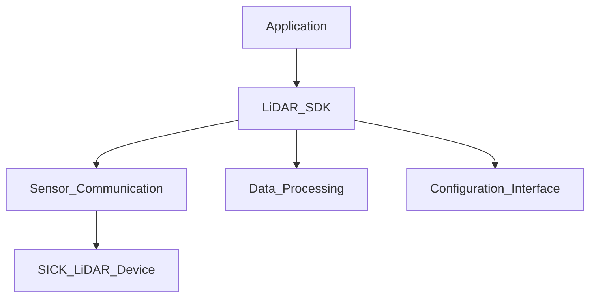

<div align="center">


# sick_perception_sdk

A modern C++17 SDK for developing applications with various SICK LiDAR sensors and access to device configuration, scan data, and integration examples.


[](LICENSE)
[](https://github.com/SICKAG/sick_perception_sdk)
[](https://github.com/SICKAG/sick_perception_sdk)

[⚡️Getting started](#️getting-started) • [📖 Code Documentation](https://github.com/SICKAG/sick_perception_sdk/ghpages) • [🔄 Change Log](https://github.com/SICKAG/sick_perception_sdk/CHANGELOG.md)

<!-- FIXME link -->

</div>

<details>
  <summary><strong style="font-size:1.25em">Table of contents</strong></summary>

- [✨ Features](#-features)
- [🛠️ Tested Compatibilities](#️-tested-compatibilities)
- [📦 Code Dependencies](#-code-dependencies)
- [⚡️Getting Started](#️getting-started)
  - [Linux Prerequisites](#linux-prerequisites)
  - [Windows Prerequisites](#windows-prerequisites)
  - [Clone the Repository](#clone-the-repository)
  - [Build Instructions (CMake build including all Examples in-tree)](#build-instructions-cmake-build-including-all-examples-in-tree)
  - [Build Instructions (cmake install including a single Example)](#build-instructions-cmake-install-including-a-single-example)
  - [Network Setup](#network-setup)
  - [Sensor Setup](#sensor-setup)
  - [Learning Examples](#learning-examples)
- [⚙️ CMake Configurations](#️-cmake-configurations)
- [🕹️ Usage](#️-usage)
  - [Data Streaming](#data-streaming)
  - [Device Configuration](#device-configuration)
  - [Find Devices in the Network](#find-devices-in-the-network)
  - [Firmware Update](#firmware-update)
- [🧠 Technical Background](#-technical-background)
  - [SDK Architecture](#sdk-architecture)
  - [Data Structures](#data-structures)
  - [Time Synchronization](#time-synchronization)
- [🛠️ Troubleshooting and FAQ](#️-troubleshooting-and-faq)
  - [No Connection to the Device](#no-connection-to-the-device)
  - [No Data Streaming](#no-data-streaming)
  - [No Device Configuration](#no-device-configuration)
- [🔑 License](#-license)
- [💬 Feedback and Issues](#-feedback-and-issues)
  - [Requesting New Features](#requesting-new-features)
  - [Reporting a Bug](#reporting-a-bug)
- [🤝 Contributing](#-contributing)

</details>

## ✨ Features

- Receive scan data in SICK data format **Compact** over **UDP** or **TCP**
- Device configuration via **REST API**
- **Thread-safe** and event-driven data acquisition from multiple devices
- Cross-platform build system using **CMake** for Linux and Windows
- Dependency management via **Conan 2** possible
- Compatible with **x64, x86 and ARM** architectures (e.g. Raspberry Pi)
- Multiple **ready-to-use examples** for fast prototyping
- Built-in **diagnostic and logging** capabilities
- Comprehensive **unit tests** with included real-world test data provided

## 🛠️ Tested Compatibilities

|                          |                                                                                                                                                                                                                                                                                                       |
| ------------------------ | ----------------------------------------------------------------------------------------------------------------------------------------------------------------------------------------------------------------------------------------------------------------------------------------------------- |
| **SICK devices**         | ✅ [**multiScan100 Family**](https://www.sick.com/multiscan100) (multiScan136, multiScan165, multiScan165-S, multiScan166)<br>✅ [**multiScan200 Family**](https://www.sick.com/multiscan200) (multiScan270)<br>✅ [**picoScan100 Family**](https://www.sick.com/picoscan100) (picoScan120, picoScan150) |
| **Target Architectures** | ✅ x64 (64-bit)<br>✅ ARM (64-bit)                                                                                                                                                                                                                                                                      |
| **Build Tools**          | ✅ GCC 11.5<br>✅ Clang/LLVM 13<br>✅ MSVC 19.29<br>✅ CMake 3.24                                                                                                                                                                                                                                         |
| **Language Standard**    | ✅ C++17<br>❌ C++14                                                                                                                                                                                                                                                                                    |
| **Platforms**            | ✅ Ubuntu 22.04 LTS<br> ✅ Ubuntu 24.04 LTS<br>✅ Windows 11<br>❌ macOS                                                                                                                                                                                                                                  |

> [!NOTE]  
>
> - Across all supported architectures, operating systems and compilers, the end-of-life (EOL) support for this repository is aligned with the officially communicated standard support timelines of each respective targets.
> - The code base has been tested against the latest device firmware. Find the latest device firmware on [https://www.sick.com/](https://www.sick.com/).

## 📦 Code Dependencies

| Name          | Version   | License                                                                     |
| ------------- | --------- | --------------------------------------------------------------------------- |
| cpp-httplib   | >=v0.25.0 | [MIT License](https://github.com/yhirose/cpp-httplib/blob/v0.25.0/LICENSE)  |
| googletest    | >=1.14.0  | [BSD-3 License](https://github.com/google/googletest/blob/v1.14.0/LICENSE)  |
| nlohmann_json | >=3.12.0  | [MIT License](https://github.com/nlohmann/json/blob/v3.12.0/LICENSE.MIT)    |
| OpenSSL       | >=3.3.2   | [Apache-License 2.0](https://openssl-library.org/source/license/index.html) |
| plog          | >=1.11.1  | [MIT License](https://github.com/SergiusTheBest/plog/blob/1.1.11/LICENSE)   |
| zlib          | >=1.3.1   | [License](https://zlib.net/zlib_license.html)                               |
| CppSockets    | -         | [License](/src/compact_receiver/include/compact_receiver/socket/Socket.hpp) |

> [!NOTE]
> To exclude googletest from the build, set the CMake flag `BUILD_UNIT_TESTS` to `OFF`.

<!-- FIXME: where / in which file to set this?? -->

## ⚡️Getting Started

### Linux Prerequisites

Before you can build the SDK, make sure the following tools are installed on your system:

```bash
sudo apt update                       # Update package lists
sudo apt install -y git               # Install Git (download source code from GitHub)
sudo apt install -y cmake             # Install CMake (cross-platform build system generator)
sudo apt install -y build-essential   # Install C++ compiler with C++17 support
sudo apt install -y libssl-dev        # Install OpenSSL (required for authentication)
```

Make sure all these tools are available in your PATH so that the following commands return valid outputs:

```bash
git --version
cmake --version
gcc --version
openssl version
```

### Windows Prerequisites

Before you can build **sick_perception_sdk**, make sure the following tools are installed on your system:

- **Git** is used to download the source code from GitHub.
  - Check if already installed with `git --version`.
  - Install via [https://git-scm.com/downloads](https://git-scm.com/downloads).
- **OpenSSL** is required for authentication.
  - Check if already installed with `openssl version`.
  - Install via [https://slproweb.com/products/Win32OpenSSL.html](https://slproweb.com/products/Win32OpenSSL.html)
  - Add the installation directory to your PATH (e.g., C:\Program Files\OpenSSL-Win64\bin). Do not use a "light" version.
- **Visual Studio Build Tools** is used to build the code.
  - Check if already installed with `cl`.
  - Install via [https://visualstudio.microsoft.com/visual-cpp-build-tools/](https://visualstudio.microsoft.com/visual-cpp-build-tools/).
  - Make sure to tick the boxes for **MSVC**, **Windows 11 SDK** and **C++ CMake** within the **Desktop development with C++** installation.
  - Add the installation directory to your PATH for both MSVC and CMake:
    - for **MSVC** e.g., C:\Program Files (x86)\Microsoft Visual Studio\2022\BuildTools\VC\Tools\MSVC\14.44.35207\bin\Hostx64\x64
    - for **CMake** e.g., C:\Program Files (x86)\Microsoft Visual Studio\2022\BuildTools\Common7\IDE\CommonExtensions\Microsoft\CMake\CMake\bin

Check all tools at once within a _Windows PowerShell_:

```pwsh
git --version
openssl version
cmake --version
cl
```

Expected output (versions might differ):

```pwsh
C:\Users\usr>git --version
git version 2.51.0.windows.1

C:\Users\usr>openssl version
OpenSSL 3.5.2 5 Aug 2025 (Library: OpenSSL 3.5.2 5 Aug 2025)

C:\Users\usr>cmake --version
cmake version 3.31.6-msvc6  

C:\Users\usr>cl
Microsoft (R) C/C++ Optimizing Compiler Version 19.44.35219 for x86
```

### Clone the Repository

```bash
git clone https://github.com/sick-ag/sick_perception_sdk.git
cd sick_perception_sdk
```

### Build Instructions (CMake build including all Examples in-tree)

This workflow shows how to build the SDK libraries and the examples in one step without installing the libraries.

```bash
# Download and install dependencies (Windows PowerShell)
./install_third_party.ps1 Release
# Download and install dependencies (Linux Bash)
./install_third_party.sh Release

# Configure and build all projects including examples
cmake -S . -B build -DCMAKE_PREFIX_PATH="$PWD/install" -DCMAKE_BUILD_TYPE=Release -DBUILD_EXAMPLES=ON
cmake --build build -j --config Release

# Run the built example (Windows PowerShell)
./build/bin/Release/picoScan100_configuration_and_streaming_example.exe
# Run the built example (Linux Bash)
./build/bin/Release/picoScan100_configuration_and_streaming_example
```

> [!NOTE]
> To exclude googletest from the build, set the CMake flag `BUILD_UNIT_TESTS` to `OFF`.

### Build Instructions (cmake install including a single Example)

This workflow shows how to build the SDK libraries, install them to `/install`, and build an example project that consumes the installed libraries.

```bash
# Download and install dependencies (Windows PowerShell)
./install_third_party.ps1 Release
# Download and install dependencies (Linux Bash)
./install_third_party.sh Release

# Configure and build the main project
cmake -S . -B build -DCMAKE_PREFIX_PATH="$PWD/install" -DCMAKE_BUILD_TYPE=Release
cmake --build build -j --config Release

# Install the built libraries. Configure your own install directory if required.
cmake -S . -B build -DCMAKE_INSTALL_PREFIX="$PWD/install" -DCMAKE_BUILD_TYPE=Release
cmake --build build --target install

# Build an example
cd examples/picoScan100/configuration_and_data_streaming
cmake -S . -B build -DCMAKE_PREFIX_PATH="$PWD/../../../install" -DCMAKE_BUILD_TYPE=Release
cmake --build build -j --config Release

# Run the built example (Windows PowerShell)
./build/Release/picoScan100_configuration_and_streaming_example.exe
# Run the built example (Linux Bash)
./build/Release/picoScan100_configuration_and_streaming_example
```

### Network Setup

Ensure your PC and your SICK devices are all within the same subnet and your ethernet interface uses a static IP address (e.g. 192.168.0.100).

> [!NOTE] Note for Windows  
>
> Ensure that the network interface used for sensor communication is set to **Private** in Windows network settings. If the interface is marked as **Public**, incoming UDP packets may be blocked by the firewall. Use a _Windows PowerShell_ to read the profile number with `Get-NetConnectionProfile` and `Set-NetConnectionProfile -InterfaceIndex 3 -NetworkCategory Private` to set this profile to `Private` (if necessary, run as administrator). Adapt your profile number accordingly.

### Sensor Setup

1. Power on the device and wait until the boot sequence is complete. A green status LED indicates operational readiness.
2. Establish the network connection by attaching the Ethernet cable to the device.
3. Verify IP configuration. The device must reside in the same subnet as the host system. The factory default IP address is [http://192.168.0.1/](http://192.168.0.1/).
4. (Optional) Configure a custom IP address. Changing the default requires authentication. The predefined credentials are: User: `Service` and Password: `servicelevel`


### Learning Examples

Checkout the learning examples to get started.

- [multiScan100 Learning Examples](examples/multiScan100_learning_examples.md)
- [multiScan200 Learning Examples](examples/multiScan200_learning_examples.md)
- [picoScan100 Learning Examples](examples/picoScan100_learning_examples.md)

Depending on the selected example and the operating system, you can start the executable as follows:  

## ⚙️ CMake Configurations

| CMake Option           | Description                                      | Default Value |
| ---------------------- | ------------------------------------------------ | ------------- |
| `BUILD_EXAMPLES`       | Build example applications                       | `OFF`         |
| `BUILD_UNIT_TESTS`     | Build unit tests (requires googletest)           | `ON`          |
| `CMAKE_BUILD_TYPE`     | Build configuration (Release, Debug)             | `Release`     |
| `CMAKE_INSTALL_PREFIX` | Installation directory for libraries and headers | `install`     |
| `CMAKE_PREFIX_PATH`    | Path to dependencies (third-party libraries)     | -             |

## 🕹️ Usage

### Data Streaming

The SDK offers multiple callbacks, depending on the connected device, to process data (e.g. scan data, imu data or ambient light data).

#### Segmented Scan Data Callback

```cpp

```
<!-- FIXME: link doxygen -->

#### Full Frame Callback

```cpp

```
<!-- FIXME: link doxygen -->

#### Point Cloud Callback

```cpp

```
<!-- FIXME: link doxygen -->

The content of the point cloud can be configured individually. For more details, refer to: `/src/compact_receiver/include/compact_receiver/PointCloudConfiguration.hpp`

#### Ambient Light Data Callback

```cpp

```
<!-- FIXME: link doxygen -->

#### IMU Data Callback

```cpp

```
<!-- FIXME: link doxygen -->

>The IMU is factory calibrated. Recalibration is not possible.

### Device Configuration

The SDK reads device settings via the REST interfaces. For more details see `\src\sensor_configuration`. Example:

```cpp

```
<!-- FIXME: Convenience function-->
<!-- FIXME: link doxygen -->

>The possible sensor configurations depend on the device variant used and the installed licenses.

The SDK writes devices configurations via the REST interfaces, using a challenge–response authentication method for secure access. For more details see: `\src\sensor_configuration`. Example:

<!-- FIXME: add a example with a Convenience function (scanDataStreaming) and add the doxygen link-->

```cpp

```

<!-- FIXME: add a example with a standard function (set device time) function and add the doxygen link-->

```cpp

```

It is also possible to import and export a full device configuration (.json).

```cpp

```
<!-- FIXME: add code and link doxygen -->

### Find Devices in the Network

```cpp

```
<!-- FIXME: add code and link doxygen -->

### Firmware Update

```cpp

```
<!-- FIXME: add code and link doxygen -->

## 🧠 Technical Background

### SDK Architecture

<!-- FIXME: UML / Mermaid like  overview-->



### Data Structures

The SDK receives the SICK data format _Compact_ from the devices, which contains radial distances, intensity, angles, and timestamps. For full documentation, refer to the [Data format description](https://www.sick.com/8028132). The format parser is located in `\src\ScanDataParser.cpp`.

For more convenient handling, the SDK also provides a conversion to point cloud in `src\compact_receiver\src\PointCloudConverter.cpp`.

### Time Synchronization

When using two or more LiDARs in a combined system, accurate time alignment of scan data is important. The recommended approach is to enable **PTP (Precision Time Protocol)** on all devices and the host system. This reduces drift compared to NTP and enables accurate fusion of multi-sensor data.

> [!NOTE]
>
> - The current system time can be read and set with: <!-- FIXME: add doxygen link to systemTime(*this) -->
> - The time synchronization method can set with: <!-- FIXME: add doxygen link to timeSynchronization(*this) -->

## 🛠️ Troubleshooting and FAQ

### No Connection to the Device

First, check if the device is powered on. A green LED on the device indicates that it is running. If the LED is off, verify that the power supply is connected and working. If the device is powered but still not reachable, check your network settings. Make sure your PC is in the same subnet as the device.  Try to ping the device to confirm connectivity. If the connection still fails, verify that you are using the correct IP address. The default IP address of the device is `192.168.0.1`.

### No Data Streaming

If no data is being received, ensure that UDP traffic is not blocked by a firewall. On Windows systems, make sure the network interface is set to `Private` using the `Get-NetConnectionProfile` / `Set-NetConnectionProfile` command.

### No Device Configuration

If you cannot access the device configuration, confirm that you are using the correct password. If the password has been changed, update your login credentials accordingly.

Use the diagnosis examples (e.g. [examples\picoScan100\diagnosis\main.cpp](examples\picoScan100\diagnosis\main.cpp)) to get some basic diagnosis information.

## 🔑 License

This project is licensed under the [Apache License 2.0](LICENSE).

## 💬 Feedback and Issues

For SDK- or code-related issues, use the GitHub Issues section of this repository. This keeps discussion transparent and enables community-driven fixes.
For sensor-specific issues (hardware defects or replacement), contact your local SICK sales and service representative. Local contacts are listed on the [SICK Website](https://support.sick.com).

### Requesting New Features

If you have ideas for improvements or new functionality:

- Describe the feature clearly and concisely.
- Include the use case or problem it solves.
- Submit your request via [https://github.com/SICKAG/sick_perception_sdk/issues](https://github.com/SICKAG/sick_perception_sdk/issues).

### Reporting a Bug

To report a bug:

- Provide steps to reproduce the issue.
- Include screenshots or logs if available.
- Submit via [https://github.com/SICKAG/sick_perception_sdk/issues](https://github.com/SICKAG/sick_perception_sdk/issues).

For both, please check existing issues before submitting to avoid duplicates.

## 🤝 Contributing

For guidelines on how to contribute, please see our [contributing guide](CONTRIBUTING.md).

---
---

Keywords: multiScan, multiScan100, multiScan136, multiScan165, multiScan165-S, multiScan166, multiScan200, multiScan270, picoScan, picoScan100, picoScan120, picoScan150, LRS4000, LRS4581, LiDAR, C++, SDK, SICK Sensor, Point Cloud, 3D Scanning, Sensor Integration, Real-time Processing, SLAM, AMR, Autonomous Systems, Object Detection, Sensor Fusion, Industrial Automation, PCL, Data Parser, REST, API, C++ Driver
